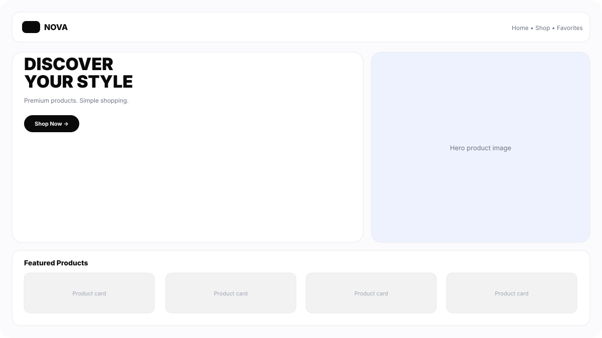
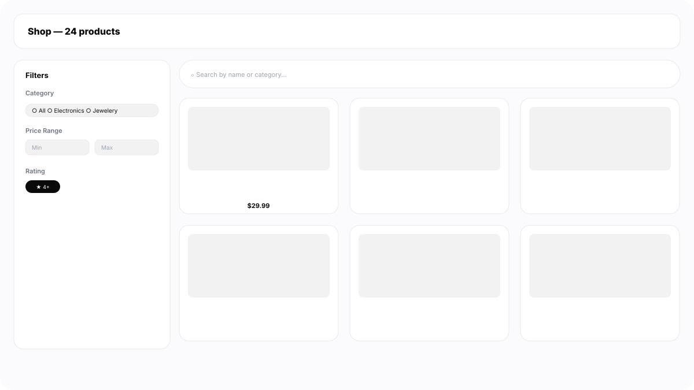
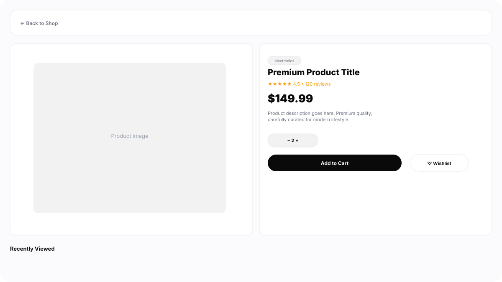

# NOVA — Premium E-Commerce Frontend

> Production-ready moderan online shop. Minimalistički Apple-style dizajn, brz UX, kompletan shopping flow.


**Live Demo:** *(dodaj Vercel link nakon deploy-a)* → `https://nova-ecommerce.vercel.app`  
**Repo:** https://github.com/FilipFilipovic-cell/e-comerc-shop

---

## ✨ Preview

| Home / Hero | Shop + Filters | Product Details |
|---|---|---|
|  |  |  |

> Placeholder SVG preview — zameni sa pravim PNG screenshot-ovima (`npm run dev` → screenshot) kad bude deploy. Fajlovi su u `public/screenshots/`.

---

## 🎯 Features

- **Home:** Hero sekcija, Featured Products (API), Shop by Category
- **Shop:** Search (naziv/kategorija), Category filter, Price min/max + slider, Rating filter, Sort (Featured / Price / Rating / Name) — sve radi zajedno
- **Product Card:** reusable, hover scale/shadow, wishlist, Add to Cart
- **Product Details:** `/product/:id`, quantity selector, related + recently viewed (LocalStorage)
- **Cart:** `/cart`, +/−, remove, auto subtotal/shipping/total
- **Wishlist:** `/favorites`, LocalStorage, quick Add to Cart
- **State:** Context API (Cart / Wishlist / Theme / Toast) + LocalStorage persist
- **Theme:** Dark/Light toggle bez reload-a, čuva se u LocalStorage, pokriva bg/text/cards/borders/buttons/inputs/navbar
- **API:** Fake Store API (`https://fakestoreapi.com`) sa fallback na DummyJSON, loading skeletons, error + empty states, Try Again
- **UX:** Toasts, responsive (1920→375px), hamburger + filter drawer na mobile, suptilne animacije (premium, ne flashy)
- **Ostalo:** Custom 404, Footer, Accessibility (semantic HTML, alt, aria-label, focus), performance optimizacije

---

## 🧱 Tech Stack

- **React 19** + **Vite 8** + **React Router 7**
- **JavaScript / HTML5 / CSS3** (bez UI framework-a, čist CSS sa CSS varijablama za theming)
- **REST API** (`fetch`), **LocalStorage**, **Hooks**, **Context API**

---

## 📁 Struktura

```
src/
├── components/
│   ├── Navbar.jsx
│   ├── Footer.jsx
│   ├── ProductCard.jsx
│   ├── LoadingSkeleton.jsx
│   └── EmptyState.jsx
├── pages/
│   ├── Home.jsx
│   ├── Shop.jsx
│   ├── ProductDetails.jsx
│   ├── Cart.jsx
│   ├── Favorites.jsx
│   └── NotFound.jsx
├── context/
│   ├── ThemeContext.jsx
│   ├── CartContext.jsx
│   ├── WishlistContext.jsx
│   └── ToastContext.jsx
├── services/
│   └── api.js
├── hooks/
│   └── useLocalStorage.js
├── App.jsx
├── main.jsx
└── index.css  # design system + dark/light varijable
```

---

## 🚀 Quick Start

```bash
# 1. kloniraj
git clone https://github.com/FilipFilipovic-cell/e-comerc-shop.git
cd e-comerc-shop

# 2. instaliraj
npm install

# 3. dev server
npm run dev
# → http://localhost:5173

# 4. build
npm run build
npm run preview
```

Nema `.env` — API je javan.

---

## 🌗 Dark / Light

Toggle u navbaru → `data-theme` na `html` + `localStorage.setItem('nova-theme')`. Pokriva celu aplikaciju.

---

## 💾 LocalStorage ključevi

- `nova-cart` — korpa
- `nova-wishlist` — lista želja
- `nova-theme` — `light` / `dark`
- `nova-recent` — poslednjih 6 pregledanih proizvoda

---

## 🔌 API

- `GET /products` → `getProducts()` sa fallback na `dummyjson.com`
- `GET /products/:id` → `getProduct(id)`
- `GET /products/categories` → `getCategories()`

Error handling: skeleton → error state sa `Try Again`.

---

## ✅ Final Check

- [x] Navbar + mobile hamburger
- [x] API + skeletons + error/empty states
- [x] Search / Category / Price / Rating / Sort
- [x] Product Details + Recently Viewed
- [x] Add to Cart + Qty + Total
- [x] Wishlist
- [x] LocalStorage (cart/wishlist/theme)
- [x] Dark mode
- [x] Toasts + 404 + responsive (375→1920)

---

## 📜 License

MIT — slobodno koristi za portfolio.

---

**Autor:** [@FilipFilipovic-cell](https://github.com/FilipFilipovic-cell) — NOVA je portfolio projekat rađen kao production-ready e-commerce frontend.
